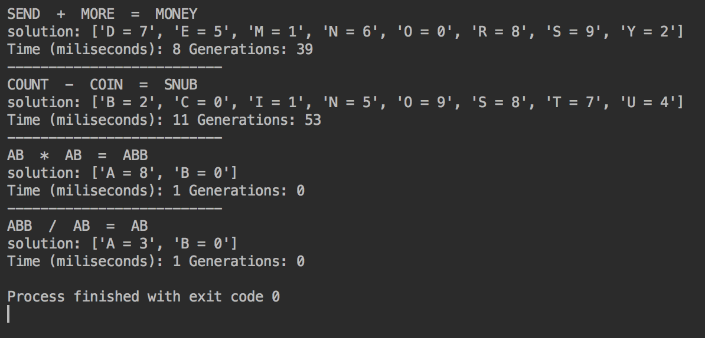
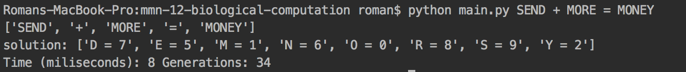

# MMN 12 Biological Computation

Roman Smirnov - 312914443

-------------------------------------------------

## Question 1

??????

---------------------------------------------------

## Question 2

### Overview

The project is a implementation of a cryptarithmetic problem solver via a genetic/evolutionary algorithm.

### Usage

1. Install Python 3.5+

2. Install Numpy

3. cd to project root

4. input a command in the following format ``` python main.py <term a> <operator> <term b> = <result term> ```

   ​

#### Output demo



#### Terminal usage demo 




### Implementation Overview

The algorithm was designed for parallelization to test the capabilities of Python's Numpy library.

#### Problem Definition

We generally define a cryptarithmatic problem as a CSP.

_Variables_: 

each variable is a unique uppercase English alphabet letter (A-Z).

_Domain_: 

each variable can be assigned an integer from the range [0,9]

_Constraints_:

1. Each variable is denoted by a unique uppercase letter. 
2. Each variables must have a unique integer assigned to it. 
3. By way of constraint 2 and the domain definition, there can be a at most 10 variables. 
4. The assignment satisfies the solution criteria.

_Solution_:

 a  solution is reached when the evaluation function returns 0.

_Evaluation Function_:

The evaluation function for addition puzzles is defined as ```` eval = result_term - first_term - second_term ````. The evaluation functions of the other puzzles are formulated algebraicly in a a similar fashion to the above. 

#### Run Time Concerns

The run time is arbitarly constrained to terminate after 1 second.

#### Problem Encoding and Assignment Encoding

The problem is encoded by way of a 10-tuple a which maps variables (characters) into array indices. Values at the array indices encode the assignment for each variable. 

```
[ 'a', 'b', 'c'] --> [0, 3, 5]	# a = 0, b = 3, c = 5
```

Several alternatives were considered: Lehmer codes, binary character sequence encoding, etc. The above method was chosen because it's good enough and was already partially implemented when doing some exploratory coding. 

We define each 10-tuple of integers, which represents the assignment,  as the genotype.

#### Evaluation

The evaluation function is encoded into an column vector of integers representing the location of the variable in the problem term. This representation allows for efficient concurrent evaluation of the genotype population via matrix multiplication

> NOTE: the genotype population is represented by a matrix - each row is a genotype

$$\begin{bmatrix} a_0 & a_1 & a_2 & ... \\ b_0 & b_1 & b_2 & … \\ & … \end{bmatrix} \cdot \begin{bmatrix} 1 \\ 10  \\ ...\end{bmatrix} =  \begin{bmatrix} eval(a) \\ eval(b) \\ ... \end{bmatrix}$$ 

Thus, we implement the evaluation of the whole genotype population very efficiently and with very few lines of code. 

#### Mutation

We implement the mutation by taking the transpose of the population matrix and swaping two random columns. 

$$ \begin{bmatrix} a_0 & b_0 &   ... \\ a_1 & b_1 & ... \\ a_2 & b_2 & … \\ & ... \end{bmatrix} \Rightarrow  \begin{bmatrix} b_0 & a_0 &   ... \\ b_1 & a_1 & ... \\ b_2 & a_2 & … \\ & ... \end{bmatrix}   $$

#### Fitness 

The fitness function is boolean matrix of the same dimensions as the population matrix (i.e a mask). It's produced by comparing the evaluations of two distinct populations and marking the lower valued (better) genotypes for selection. 

#### Reproduction

There are two methods of reproduction:

1. The genotype population is compared against a mutated copy of itself in a randomized pairing. Better genotypes are wholly selected - there's no crossover. This method seems to lead to convergence very rapidly. 
2. The genotype population is compared against a newly and independently created, randomized, population (i.e a niche). This method is computationally slower overall and is slow to converge, but is very useful for avoiding local minima (evaluation wise) . 

The first method is used most of the time. The second method is used at  a set interval to help avoid local evaluation minima. 

####Algorithm Formulation

_Prep_:

1. the problem is encoded 
2. a seed population is generated 

_Main Loop_:

1. a rival population is produced 
2. both populations are evaluated and checked for the presence of the solution 
3. a fitness matrix is produced
4. an element-wise selection (one from each pairing) occurs and populations are unified. 


